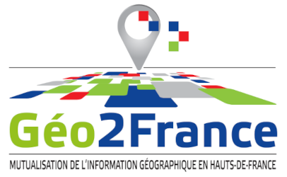

# Contrôle Qualité Partenarial (CQP) de l'OCS2d avec QGIS

Ce document l'utilisation des ressources préconfigurées et optimiser la vérification des différents polygones CS (couvert) et US (usage) sur le territoire des Hauts-de-France.

## Prérequis

- Version LTR [3.22] ou supérieure
- Connexion Internet (pour un affichage optimal des flux images)

## Ressources en ligne

- Télécharger l'intégralité du dépôt via le bouton **Code** > Download ZIP

- Télécharger les zones tests à vérifier via l'outil Pydio sur Geo2France : <https://www.geo2france.fr/files/ws--28/Zones_Tests/Sources>

> :information_source: **Vous devez être membre du CoTech OCS2d et connecté sur le portail Geo2France** :information_source:

## Indexer des couches téléchargeables

Référencer la ou les zones téléchargée(s) dans le tableau en ligne ci-dessous et n'oubliez pas de mettre à jour le champ **Etat**
[Index_Couches_Zones_Tests_CQP](https://docs.google.com/spreadsheets/d/141QZYF7PUW_Cr1RG6Ragm9nKG9eFurMOu5JM8RGYMDk/edit?usp=sharing)

## Utilisation de QGIS

### Installation du plugin Go2NextFeature3

Avant de lancer le projet, téléchargez le plugin QGIS Go2NextFeature3. Ce plugin facilite le balayage d'entités.
Dans QGIS : Menu Extensions > Installer/Gérer les extensions > Go2NextFeature3

### Fonctionnement du projet

Décompressez l'archive **ocs2d-main.zip** et ouvrez le projet QGIS du dossier **control_qualite** : model_cqp_ocs2d.qgz

Le projet contient les données en fond de plan dont vous avez besoin pour le contrôle :

- Couches fusionnées US et CS pour les millésimes 2021 / 2015 (NPDC) / 2010 (PIC)
- L'ensemble des prises de vues aériennes yu compris les images historiques pour analyser les US 6.x
- Le Scan 25

### Ajout des couches à contrôler et formulaire

Glisser/Déposer le GeoPackage dans le projet QGIS.
La mise en forme est automatique et le formulaire pré-configuré.

### Contrôle des données

1. Définir l'échelle au 1/2500

2. Cliquer sur l'icône Go2NextFeature3

3. Sélectionner la couche du GPKG à vérifier

4. Cliquer sur Next pour parcourir les entités

5. Utilisez le pour interroger le formulaire

> :warning: Si le formulaire QGIS ne s'affiche pas, assurez vous d'avoir correctement paramétré QGIS :warning:

### En images

/TODO

### FAQ

**Q.** La photo aérienne de 1998 semble être décalée par rapport aux données ?
**R.** L'image 1998 sur le Nord-Pas-De-Calais présente un problème de projection, des investigations sont en cours. Cependant, il n'y a pas d'incidence pour le contrôle.

